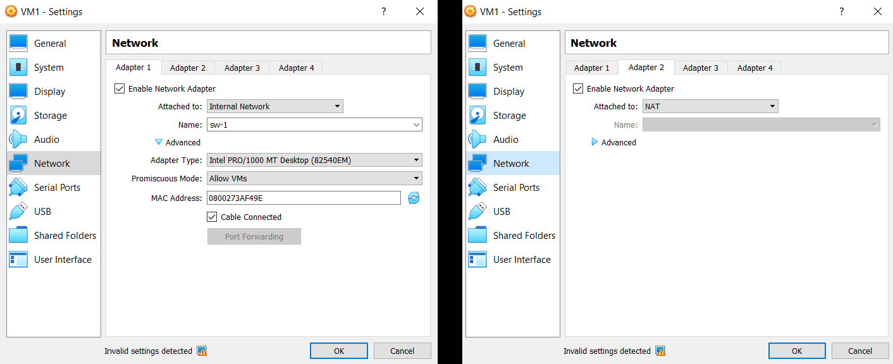
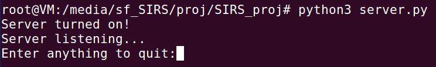
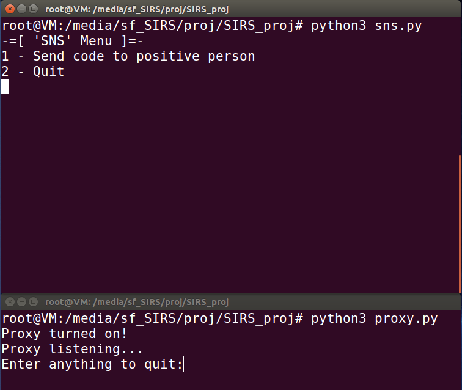
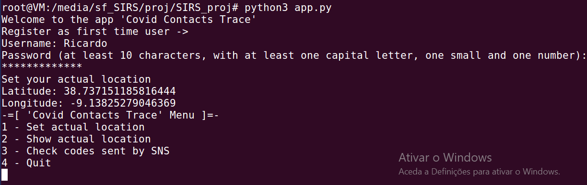
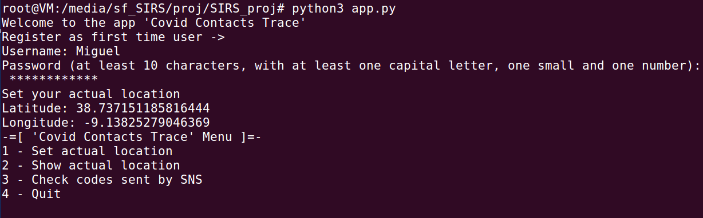
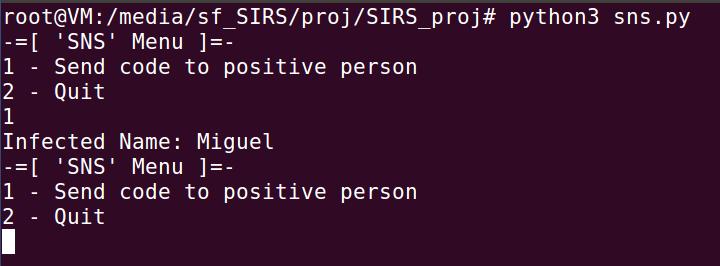
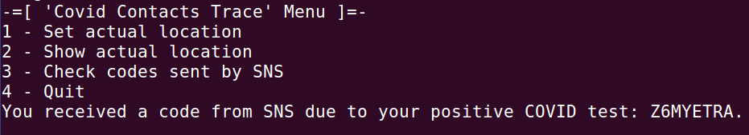
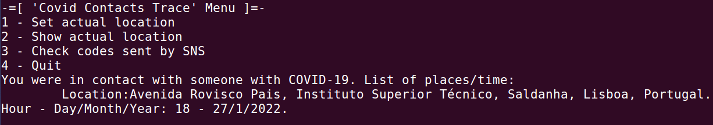

# Contact Tracing

O COIVD-19 é uma infeção que tem vindo a afetar bastantes pessoas, até as que estão vacinadas contra esta. Um dos grandes problemas no combate desta infeção é o rastreamento dos contactos efetuados por uma pessoa infetada, impedindo travar a cadeia de transmição.

## Informação Geral

Com o objetivo de tornar mais fácil o rastreio dos contactos efetuados por uma pessoa que testou positivo ao COVID-19, criámos esta app que informa os seus utilizadores quando estes tiveram em contacto, nos últimos 14 dias, com um outro utilizador da aplicação que esteja infetado.

Um contacto ocorre sempre que um utilizador da app se encontre a uma distância igual ou inferior a 5 metros de outro utilizador.

A aplicação permite rastrear os contactos mantendo sempre a confidencialidade de todos os utilizadores da app, incluindo as pessoas que estão infetadas, e impedindo que terceiros possam descobrir as rotinas diárias dos utilizadores.

### Construído com

A aplicação foi programada em Python3 e foram utilizadas diversas bibliotecas de Python que se encontram listadas a seguir.

* [Python3](https://www.python.org/) - Linguagem de Programação
* [ssl](https://docs.python.org/3/library/ssl.html) - TLS/SSL para Sockets
* [Crypto](https://pypi.org/project/pycrypto/) - Ferramentas de Criptografia para Python
* [geopy.geocoders](https://pypi.org/project/geopy/) - Ferramentas de Geocodificação para  Python
* [stdiomask](https://pypi.org/project/stdiomask/) - Módulo de Python para Inserir Senhas
* [pickle](https://docs.python.org/3/library/pickle.html) - Serialização de Objetos Python

## Vamos Começar


### Pré-requisitos

Para poder usar a aplicação, primeiro é necessário correr o Servidor Central, o Proxy e a Autoridade de Saúde. Todos estas entidades devem correr em sistema operativo Ubuntu-16.04-32bit em máquinas separadas, excepto o Proxy e a Autoridade de Saúde, interligadas na mesma rede. 

Recomendamos o uso de [Oracle VM VirtualBox](https://www.oracle.com/virtualization/technologies/vm/downloads/virtualbox-downloads.html) de forma a ser possível executar o projeto na mesma máquina através de diferentes Máquinas Virtuais e a imagem de máquina virtual pré-criada fornecida pela [SEED Labs Project](https://seedsecuritylabs.org/lab_env.html) (sugerimos a versão de junho de 2019). 

No caso de seguirem estas recomendações aqui estão as [instruções](https://seedsecuritylabs.org/Labs_16.04/Documents/SEEDVM_VirtualBoxManual.pdf) fornecidas pela SEED Labs Project para instalar a imagem pré-criada na VirtualBox.

Todas as VMs devem ter configuardo o "Adapter 1" e "Adapter 2" na sua seção "Network" de acordo com as seguintes imagens: 



Em seguida é necessário configurar as VMs para estas terem o IP correto, de acordo com a seguinte tabela:

| # Interface | Entidade | Subnet | Adapter | 
|:---:|:---:|:---:|:---:|
| __VM1__ |||||||
| 1 | __Servidor Central__ | 192.168.0.1 | enp0s3 |
| __VM2__ |
| 1 | __Proxy__ e __Autoridade de Saúde__ | 192.168.0.4 | enp0s3 |
| __VM3__, __VM4__, etc... : |
| 1 | __Utilizador__ | 192.168.0.[2,3,5,6,...,254] | enp0s3 |

Esta configuração pode ser feita de forma simple e permanente editando o ficheiro `/etc/network/interfaces` de cada VM para o seguinte (onde está \<ip\> colocar o correto para cada VM):

```
auto enp0s3
iface enp0s3 inet static
    address <ip>
    netmask 255.255.255.0
    dns-nameservers 8.8.8.8 8.8.4.4

auto enp0s8
iface enp0s9 inet dhcp
```

### Instalação

Na VM correspondente ao Servidor Central deve ser aberto o terminal e correr o programa ***server.py*** da seguinte forma:

```
python3 server.py [-v] [pickle]
```
Pode ser passado como argumento a flag ***-v*** para correr em ***verbose mode*** e apresentar todas as mensagens recebidas e enviadas pelo Servidor Central e ainda ser passado um ***pickle*** caso seja pretendido carregar os dados de um Servidor Central terminado anteriormente.



Na VM correspondente ao Proxy e Autoridade de Saúde deve ser aberto dois terminais em que num deles corremos o programa ***sns.py***:

```
python3 sns.py [-v]
```
e no outro terminal corremos o programa ***proxy.py***:

```
python3 proxy.py [-v]
```
que tal como o programa ***server.py*** podemos utilizar a flag ***-v***.



## Demo

Para demonstrar o funcionamento da aplicação vamos utilizar dois utilizadores em duas VMs diferentes.

Em cada uma das VMs vamos correr o seguinte comando para iniciar a aplicação:

```
python3 app.py [-v] [pickle]
```

Pode ser passado como argumento a flag ***-v*** para correr em ***verbose mode*** e ainda ser passado um ***pickle*** caso seja pretendido carregar os dados de um Utilizador que deu logout da aplicação anteriormente.

Ao primeiro Utilizador vamos chamar "Ricardo" e vamos introduzir como localização o Pavilhão de Informática do Instituto Superior Técnico Alameda (
38.737..., -9.1382...):



Ao segundo Utilizador vamos chamar "Miguel" e vamos colocá-lo na mesma posição que o "Ricardo" de forma a simular um contacto entre estes Utilizadores:



Vamos agora simular que o "Miguel" testa positivo à COVID-19 e que a Autoridade de Saúde lhe envia um código para enviar ao Servidor Central:



Desta forma "Miguel" recebe o código:



E "Ricardo" recebe um alerta de que teve um contacto com um Utilizador que testou positivo:



## Autores

### Grupo 4

102335 [Guilherme Gaspar](mailto:guilherme.r.gaspar@tecnico.ulisboa.pt)

92523 [Matheus Franco](mailto:matheusguilherme99@tecnico.ulisboa.pt)

92562 [Tiago Fournigault](mailto:tiago.fournigault@tecnico.ulisboa.pt)